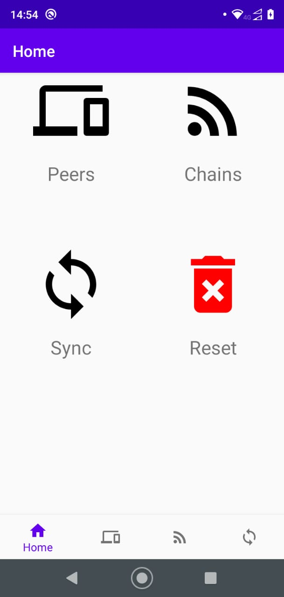
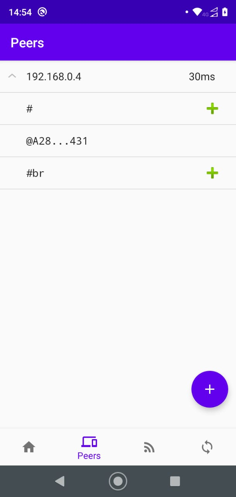

# Freechains Dashboard - Android

## Install APK

- Download the latest release `freechains-android-vX.X.X-XX.apk`
- Copy the `apk` to your Android device
- Open the `apk` in the Android File Manager
- Enable "install unknown apps"
- Select "Install"

## Compile from sources

1. Clone the source repositories:

```
$ git clone https://github.com/Freechains/freechains.kt
$ git clone https://github.com/Freechains/android-dashboard
```

2. Copy files from `freechains.kt` to `android-dashboard`:

```
$ cd android-dashboard/
$ ./copy.sh
```

3. Open `IntelliJ IDEA`
    - Open project/directory `android-dashboard/`
    - Run on selected device

## Screenshots




